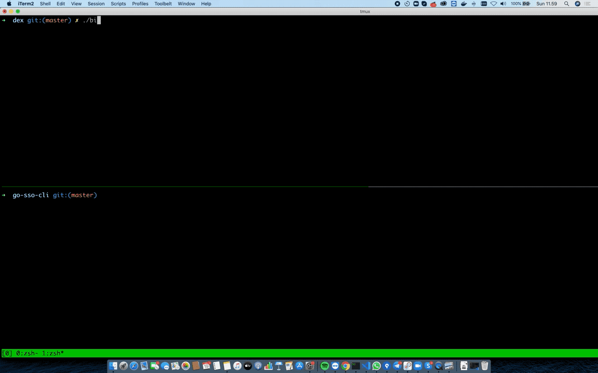

GO-SSO-CLI
===

You ever used tools which requires you to do login or authentication via termimnal like `gcloud auth login` or `argocd login` and wondering how to do oauth2 flow in cli or terminal? Here you go. I try to create a simple demo to demonstrate how Ouath2 can be done in terminal.



# Getting Started

This is a sample of ouath client. Thus, you gonna need to have oauth2 server up and running prior running using this example. There are options available:

1. Use [dexidp/dex](https://github.com/dexidp/dex) as the oauth2 server. Simply run the dex server.
1. Use google, github or any others oauth2 provider.

## Testing Against Dex Server

This client sample use `example-app` oauth2 client id and secret registered on the dex server. Thus, you can run it by using:

```
$ make build.binaries
$ ./authcli login --sso
```

## Testing Against Google or any other providers

Please create ouath2 client id and secret for any oauth2 provider you chose. You can use `http://127.0.0.1:8085/callback` as the redirectURL callback or override the value by using `--redirect-uri` flags.

If you want to use google, you can do something like 

```
$ ./authcli login --sso --client-id [CLIENT_ID] --client-secret [CLIENT_SECRET] --issuer https://accounts.google.com
```

# Security Warning

If you handle the ouath2 provider callback and exchange the oauth code with access and refresh token on the client, you might need to put the oauth client secret somewhere or directly compiled it on the binary. At this point I'm not sure whether hard coding the app secret on the binary is safe or not. So do it on your own risk. If you think that is safe enough, please let me know.